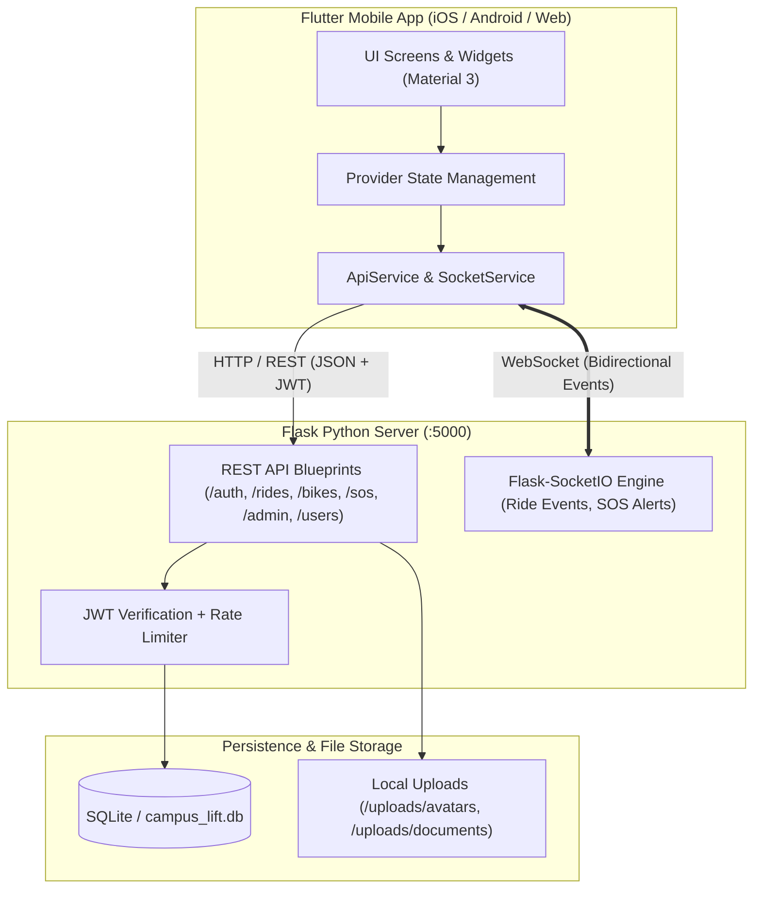

# 🚗 CampusLift — Smart & Safe University Commuting Platform

CampusLift is an end-to-end, peer-to-peer micro-mobility and ride-sharing platform designed specifically for university campuses. It connects verified students and faculty for carpooling, bike sharing, and campus transit, backed by real-time safety protocols, emergency SOS streaming, and gamified eco-rewards.

---

## 🌟 Key Problems Solved

- **Expensive & Inconvenient Commutes:** Students often pay high auto/cab fares for daily college travel. CampusLift enables peer-to-peer carpooling at minimal, shared costs.
- **Campus Safety & Trust:** Open ride-sharing platforms lack verified campus identity. CampusLift restricts access to verified college students with KYC document verification (college roll numbers, driving licenses, and vehicle registration).
- **Emergency Protection:** In-transit emergencies are backed by a real-time SOS system streaming live GPS locations and student identity directly to campus security and the admin dashboard.
- **Micro-Mobility Shortages:** A peer-to-peer bicycle rental engine allows students to rent out their idle bicycles safely with a state-machine-backed workflow.
- **Sustainability:** Encourages eco-friendly travel by calculating CO₂ savings, awarding green points, and generating verified carbon offset certificates.

---

## 🚀 Core Features

### 1. Smart Ride Matching Engine (Carpooling)
- **Haversine Distance Matching:** Computes spherical distances between student pickup coordinates and online drivers, filtering by campus proximity (within 10 km) and excluding busy drivers.
- **Gender-Based Filter:** Female passengers can optionally filter for verified female drivers for late-night campus commutes.
- **Active Community Rides:** Privacy-preserving campus-wide public feed showing real-time active trips with anonymized student names and generalized routes, enabling one-tap booking.

### 2. Peer-to-Peer Bike Rental System
- **Listing & Pricing:** Students can list their bicycles with hourly rates, pickup locations, and payment preferences (`UPI` or `Cash`).
- **Strict 6-Step Finite State Machine:**
  $$\text{requested} \longrightarrow \text{approved} \longrightarrow \text{payment\_pending} \longrightarrow \text{payment\_done} \longrightarrow \text{active} \longrightarrow \text{completed}$$
- **Concurrency & Double-Booking Prevention:** Approving one rental automatically cancels competing pending requests for the same vehicle.

### 3. Real-Time Safety & Emergency SOS
- **Continuous Live Location Streaming:** Periodic GPS polling streams live coordinates via WebSockets (`sos_location_update`) directly to the campus admin room.
- **Verified Student Identity:** SOS payloads include student name, college roll number, phone number, and branch for immediate identification.
- **Persistent Emergency Banner:** In-app emergency banner provides real-time tracking status and one-tap SOS cancellation.
- **Campus Emergency Hotlines:** Dynamic backend directory of trusted campus security, medical, and helpline contacts.

### 4. Driver Verification & KYC Pipeline
- **Document Upload:** Prospective drivers upload camera/gallery captures of their **Driving License** and **Vehicle Registration Certificate (RC)**.
- **Admin Review Modal:** Web admin panel includes full thumbnail previews and click-to-enlarge inspection modals before approving drivers.

### 5. Gamification & Eco-Certificates
- **Green Points & Leaderboard:** Earn reward points for completed carpools and bike rentals.
- **Digital Certificates:** Generates on-device PDF Carbon Offset Certificates with offline font fallbacks (`pw.Font.helvetica()`), shareable via WhatsApp, email, or print.

### 6. Web Admin Management Dashboard (`/admin`)
- **Real-Time Emergency Monitor:** Socket.IO listeners receive instant audio-visual SOS alerts.
- **Security:** Protected by JWT authentication and sliding-window brute-force rate limiting.
- **Platform Analytics & CRUD:** View platform KPIs (rides, users, alerts) and manage campus emergency contacts dynamically.

---

## 🛠️ Technology Stack

| Layer | Technologies Used |
| :--- | :--- |
| **Mobile App (Frontend)** | Flutter 3 (Dart), Provider (State Management), latlong2 & flutter_map (OpenStreetMap), image_picker, printing, pdf |
| **Backend API** | Python 3.10+, Flask, Flask-SQLAlchemy, Flask-JWT-Extended, Eventlet |
| **Real-Time Engine** | Flask-SocketIO & socket_io_client (WebSocket protocol) |
| **Database** | SQLite with idempotent PRAGMA schema migrations |
| **Security** | PBKDF2/SHA256 password hashing, JWT claims, sliding-window rate limiting |

---

## 🏗️ System Architecture



---

## ⚡ Getting Started

### Prerequisites
- [Flutter SDK](https://docs.flutter.dev/get-started/install) (`v3.19+`)
- [Python 3.10+](https://www.python.org/downloads/)
- Git

---

### Backend Setup (Flask Server)

```bash
# 1. Navigate to the backend directory
cd backend

# 2. Create and activate a Python virtual environment
python -m venv venv
# On Windows:
.\venv\Scripts\activate
# On macOS/Linux:
source venv/bin/activate

# 3. Install backend dependencies
pip install -r requirements.txt

# 4. Start the backend server (runs on http://127.0.0.1:5000)
python app.py
```

> **Default Admin Credentials:**
> - URL: `http://127.0.0.1:5000/admin`
> - Username: `admin`
> - Password: `Admin@123`

---

### Frontend Setup (Flutter App)

```bash
# 1. Open the project root
cd CampusLift_working-main

# 2. Fetch Flutter dependencies
flutter pub get

# 3. Run the app on your connected device or emulator
flutter run
```

---

## 🧪 Testing & Verification

The repository includes end-to-end automated verification suites:

```bash
# Run all backend test suites (Bike state machine, SOS safety flow, KYC uploads)
python backend/test_all_round2.py

# Run Round 1 regression verification
python backend/verify_all.py

# Run Flutter static analysis (0 errors, 0 warnings)
flutter analyze
```
